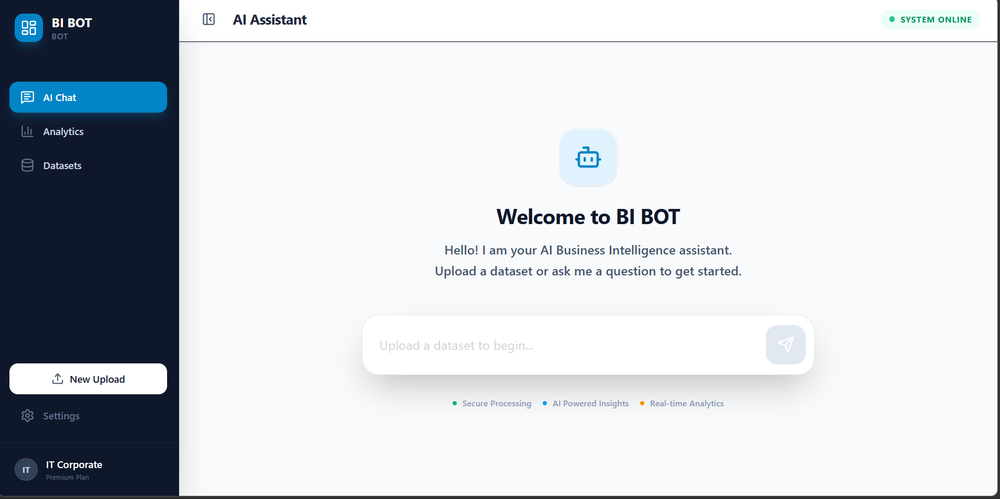

# 🤖 BI BOT: AI-Powered BI Assistant

BI BOT is a cutting-edge, AI-driven Business Intelligence assistant that bridges the gap between raw data and actionable insights. By combining the power of **React**, **FastAPI**, **Google Gemini**, and **Apache Superset**, it automates the process of data analysis and visualization.

---

## 🚀 How It Works

1.  **Data Upload**: Users upload CSV or Excel files through a modern **React-based** interface.
2.  **FastAPI Backend**: A robust **FastAPI** backend handles file processing, database integration, and communication with AI and BI engines.
3.  **Database Integration**: The data is automatically uploaded to a **PostgreSQL** database (Supabase).
4.  **AI Insights**: **Google Gemini 2.5 Flash** analyzes the dataset's structure and suggests the most relevant visualizations (metrics, distributions, trends).
5.  **Instant Dashboards**: With one click, the system communicates with **Apache Superset's API** to programmatically create datasets, charts, and a fully functional dashboard.
6.  **Interactive Chat**: Users can interact with their data using natural language to ask questions, request new charts, or get deep-dive insights powered by Gemini.

---

## ✨ Why It Is Important

-   **Zero SQL Required**: Empowers non-technical users to generate complex BI dashboards without writing a single line of code or SQL.
-   **Reduced Time-to-Insight**: Automated visualization suggestions eliminate the "blank canvas" problem, providing immediate value from uploaded data.
-   **Modern Architecture**: Decoupled frontend (Vite/React) and backend (FastAPI) for better performance, scalability, and developer experience.
-   **AI-Enhanced Analysis**: Leverages late-model Gemini LLMs to understand the semantic context of data and provide high-quality chart suggestions.

---

## 🛠️ Key Features

-   📊 **Smart Suggestions**: Automated generation of relevant charts based on data types using Gemini 2.5 Flash.
-   💬 **Conversational BI**: Advanced chatbot interface to explore data, ask analytical questions, and create on-demand visualizations.
-   📁 **Multi-Format Support**: Handle both CSV and Excel file uploads with automated table schema generation.
-   🖇️ **Live Superset Integration**: Full programmatic lifecycle management of Superset assets (datasets, charts, dashboards) via REST API.
-   🎨 **Premium UI/UX**: Built with React, Tailwind CSS, and Framer Motion for a sleek, responsive, and interactive experience.

---

## 💻 Technology Stack

-   **Frontend**: [React](https://reactjs.org/) + [Vite](https://vitejs.dev/) + [Tailwind CSS](https://tailwindcss.com/)
-   **Backend**: [FastAPI](https://fastapi.tiangolo.com/) (Python)
-   **AI Engine**: [Google Gemini 2.5 Flash](https://ai.google.dev/)
-   **BI Engine**: [Apache Superset](https://superset.apache.org/)
-   **Database**: [PostgreSQL](https://www.postgresql.org/) (Supabase)
-   **Communication**: REST APIs, SQLAlchemy, Pandas

---

## 🔗 Link to the Bot

[BI BOT 📊](https://bitestbot.streamlit.app/) *(Note: Deployment link might be updated soon to reflect new architecture)*

## UI

