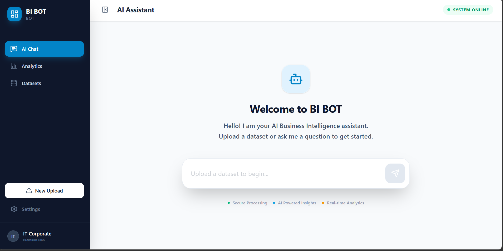

# 🤖 BI BOT: The Future of Autonomous Business Intelligence

**BI BOT** is a cutting-edge, AI-driven Business Intelligence ecosystem that seamlessly transforms raw data into high-octane actionable insights. By orchestrating a symphony of **React**, **FastAPI**, **Meta Llama 3**, and **Apache Superset**, it creates a "no-code" bridge between complex datasets and premium visual analytics.

---

## ⚡ The Intelligent Workflow

1.  **Seamless Ingestion**: Experience frictionless file uploads (CSV/Excel) through a high-performance **React** interface.
2.  **Robust Backend**: A lightning-fast **FastAPI** engine handles data orchestration, security, and complex integrations.
3.  **Enterprise Data Layer**: Your data is structured and stored in a high-concurrency **PostgreSQL** database for maximum reliability.
4.  **Neural Insight Discovery**: **Meta Llama 3 8B** (via Hugging Face) deciphers your data structure, predicting the most impactful KPIs and visualizations with surgical precision.
5.  **Autonomous Dashboarding**: Our custom integration with the **Apache Superset API** automatically constructs datasets, generates complex charts, and deploys a professional dashboard in seconds.
6.  **Conversational Analytics**: Interact with your data using natural language via our **"Maximum Shine"** chat interface—featuring rich formatting, bold metrics, and an ultra-premium UX.

---

## 🔥 Why BI BOT?

-   **Zero-SQL Paradigm**: Empowering decision-makers to skip the code and go straight to the insights.
-   **Instant Visualization**: Move from "File Uploaded" to "Dashboard Live" in record time.
-   **Advanced Semantic Understanding**: Leverages Large Language Models to understand the *meaning* behind the columns, not just the data types.
-   **Architectural Excellence**: A modern decoupled stack (Vite + FastAPI + PostgreSQL) ensures a snappy, scalable experience.

---

## ✨ Features that WOW

-   📊 **Smart KPI Suggestions**: Automated generation of Bar, Line, Pie, and Metric charts tailored to your data.
-   💬 **Flashy AI Interface**: A "Golden Standard" chat experience with bolded highlights and expressive emojis.
-   📁 **Hybrid Format Support**: Smart schema detection for both CSV and Excel workbooks.
-   🖇️ **Deep BI Integration**: Full programmatic lifecycle management of Apache Superset assets.
-   🎨 **Pixel-Perfect Design**: Crafted with Tailwind CSS and modern design principles for a truly premium feel.

---

## 🛠️ Technology Stack

-   **Frontend**: [React](https://reactjs.org/) + [Vite](https://vitejs.dev/) + [Tailwind CSS](https://tailwindcss.com/)
-   **Backend**: [FastAPI](https://fastapi.tiangolo.com/) (Python)
-   **AI Engine**: [Meta Llama 3 8B](https://llama.meta.com/llama3/)
-   **BI Engine**: [Apache Superset](https://superset.apache.org/)
-   **Database**: [PostgreSQL](https://www.postgresql.org/)
-   **Orchestration**: SQLAlchemy, Pandas, RESTful APIs

---

## 🔗 Live Implementation

[Experience BI BOT 📊](https://bitestbot.streamlit.app/)

## 📸 Interface Preview

